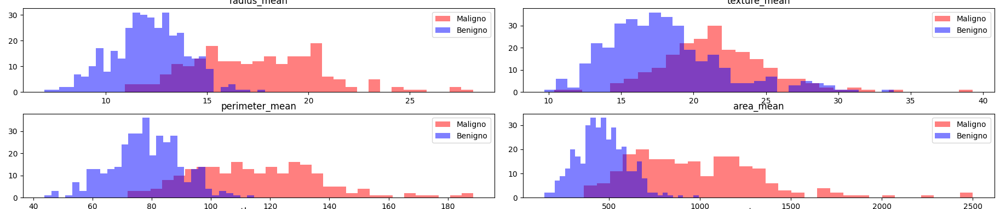
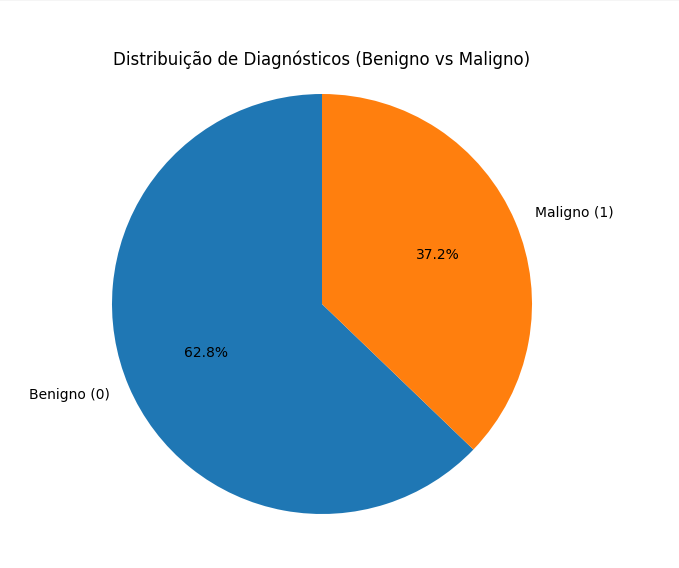
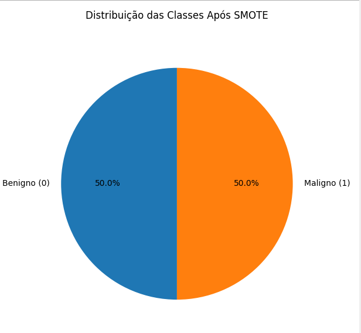
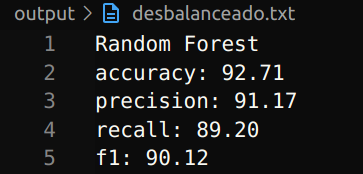
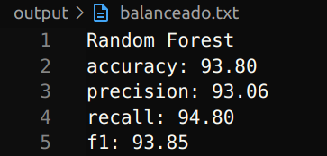
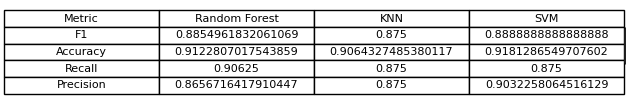

# Previsão de Câncer de Mama (Tumores Malignos)

Este projeto desenvolve um modelo de **Machine Learning (ML)** destinado a prever se um câncer de mama é maligno ou benigno, utilizando dados disponibilizados em um arquivo CSV. Esses dados contêm informações relevantes sobre pacientes e características tumorais.

O conjunto de dados utilizado é o **Conjunto de Dados de Câncer de Mama Wisconsin (Diagnóstico)**, disponível em formato CSV no seguinte link:  
[https://www.kaggle.com/datasets/uciml/breast-cancer-wisconsin-data](https://www.kaggle.com/datasets/uciml/breast-cancer-wisconsin-data)

## Índice
- [Variáveis](#variáveis)
- [Processos Realizados no Projeto](#processos-realizados-no-projeto)
  - [Leitura, Limpeza e Preparação dos Dados](#leitura-limpeza-e-preparação-dos-dados)
  - [Separação dos Dados e Seleção de Features](#separação-dos-dados-e-seleção-de-features)
  - [Modelo de Classificação](#modelo-de-classificação)
  - [Treinamento](#treinamento)
  - [Teste](#teste)
  - [Ajuste de Hiperparâmetros](#ajuste-de-hiperparâmetros)
  - [Comparação de Modelos](#comparação-de-modelos)
- [Conclusão](#conclusão)
- [Tecnologias Utilizadas](#tecnologias-utilizadas)
- [Agradecimentos](#agradecimentos)

## Variáveis

A seguir, alguns dos atributos presentes e utilizados no projeto:

1. **ID Number**
2. **Diagnosis** (M = Maligno, B = Benigno)
3. **Radius** (média das distâncias do centro aos pontos na perímetro)
4. **Texture** (desvio padrão dos valores de cinza)
5. **Perimeter**
6. **Area**
7. **Smoothness** (variação local no comprimento dos raios)
8. **Compactness** (perímetro² / área - 1.0)
9. **Concavity** (gravidade das porções côncavas do contorno)
10. **Concave Points** (número de porções côncavas do contorno)
11. **Symmetry**
12. **Fractal Dimension** ("aproximação da linha costeira" - 1)

## Processos Realizados no Projeto

### Leitura, Limpeza e Preparação dos Dados

Os dados foram examinados e os elementos desnecessários foram eliminados utilizando bibliotecas do Python, como `pandas` e `numpy`. Foram tratados valores ausentes e inconsistências para garantir a qualidade do conjunto de dados.

### Separação dos Dados e Seleção de Features

Nesta etapa, os dados foram separados em conjuntos de treino e teste. As features foram escolhidas através de uma análise exploratória, incluindo a plotagem de gráficos relacionando cada feature com tumores malignos e benignos.

**Exemplo de gráficos plotados:**

Logo em seguida fomos examinar os dados e descobrimos que os dados originais aparentavam estar desbalanceados, como pode ser visto na imagem abaixo:

Utilizamos o recurso do **SMOTE** para balancear os dados, obtendo o seguinte balanceamento:

### Modelo de Classificação

Foram selecionados os seguintes modelos de classificação:

- **Random Forest**
- **Regressão Logística**
- **Naive Bayes Gaussiano**
- **K-Nearest Neighbors (KNN)**
- **Árvore de Decisão**
- **Máquina de Vetores de Suporte (SVM)**

Além disso, foram escolhidas as seguintes métricas de avaliação:

- **Accuracy**
- **Precision**
- **Recall**
- **F1-Score**

### Treinamento

O treinamento foi realizado tanto com dados balanceados quanto desbalanceados, permitindo observar a diferença de desempenho entre os conjuntos de dados.

**Exemplo com Random Forest:**

*Dados Desbalanceados:*

*Dados Balanceados:*

### Teste

Durante os treinamentos, foram escolhidos os modelos que apresentaram os melhores valores de **Recall**, uma métrica prioritária para identificar corretamente os casos de câncer maligno.

Os modelos selecionados para a fase de teste foram:
- **Random Forest**
- **K-Nearest Neighbors (KNN)**
- **Support Vector Machine (SVM)**

A fase de teste foi realizada com os dados balanceados para verificar a generalização dos modelos.

Foi gerada também a matriz de confusão. Exemplo com Random Forest:

### Ajuste de Hiperparâmetros

Foram ajustados os hiperparâmetros dos modelos utilizando **GridSearchCV** para otimizar os resultados. A função **hyperparameter_tuning_and_evaluation** apresenta os parâmetros selecionados para cada modelo.

### Comparação de Modelos

Foram realizadas comparações entre os modelos para identificar qual se adequa melhor aos objetivos do projeto.

**Tabela de Comparação de Modelos:**

## Conclusão

Após a análise e comparação dos modelos, foi possível determinar qual apresenta o melhor desempenho na previsão de tumores malignos, considerando a métrica de **Recall** como prioritária.

Levando a conclusão que seria o **Random Forest**

## Tecnologias Utilizadas

- **Python**
- **Pandas**
- **NumPy**
- **Matplotlib**
- **Seaborn**
- **Scikit-learn**
- **Imbalanced-learn (SMOTE)**

## Agradecimentos 

Este trabalho foi desenvolvido por Bruno Santos Fernandes como parte de um projeto pessoal, Sinta-se à vontade para utilizar este projeto, mas peço que dê os devidos créditos mencionando o autor e a fonte original.

- **LinkedIn**: [Bruno Santos Fernandes](https://www.linkedin.com/in/bruno-santos-fernandes-b58824229/)
- **Instagram**: [@brunin.sf](https://www.instagram.com/brunin.sf/)
